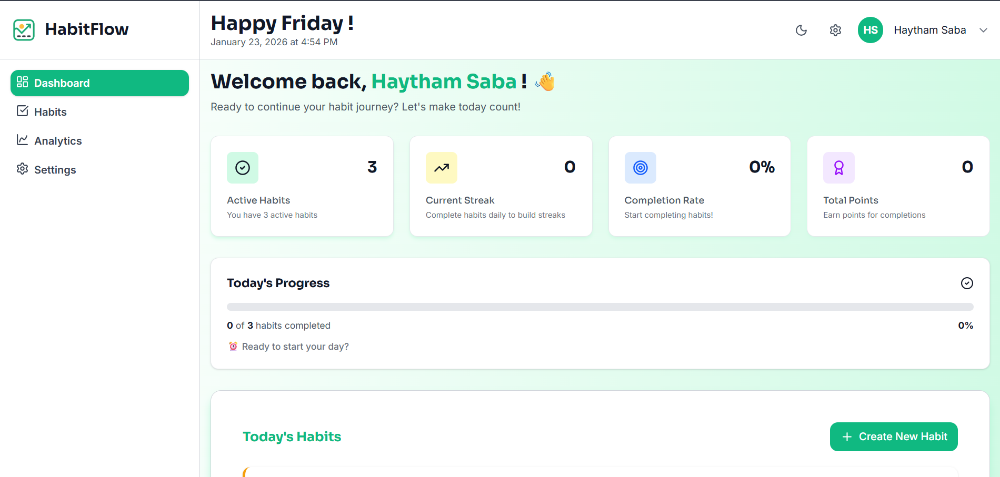
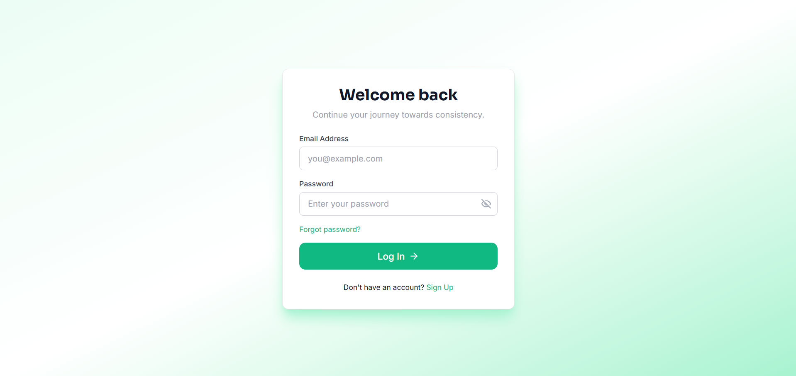
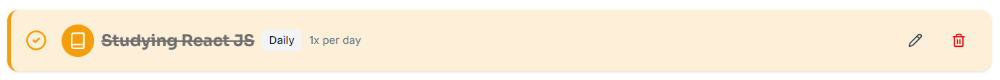
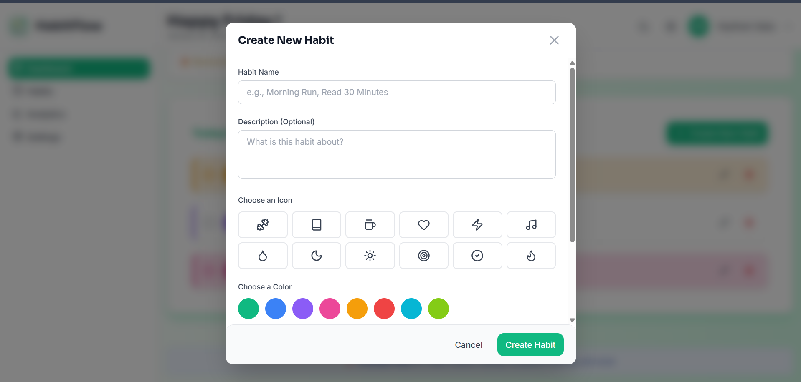
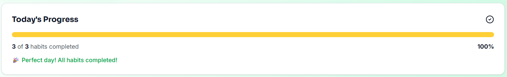

# 🎯 HabitFlow

A modern, full-stack habit tracking application built with React and TypeScript. Track your daily habits, visualize your progress, and build better routines.



## ✨ Features

- **User Authentication** - Secure signup/login with Supabase Auth
- **Habit Management** - Create, edit, and delete habits with custom icons and colors
- **Daily Tracking** - Mark habits as complete with visual feedback
- **Progress Visualization** - Real-time progress bar and completion statistics
- **Responsive Design** - Works seamlessly on desktop and mobile devices
- **Real-time Updates** - Instant synchronization across all devices

## 🚀 Live Demo

**[View Live App →](https://habitflow-hs.vercel.app)**

## 📸 Screenshots

<details>
<summary>Click to see more screenshots</summary>

### Login Page



### Habit Completion



### Create New Habit



### 100% Progress



</details>

## 🛠️ Tech Stack

**Frontend:**

- React 19.2.0 with TypeScript
- Tailwind CSS v4 for styling
- React Router for navigation
- Framer Motion for animations
- Lucide React for icons

**State Management:**

- TanStack React Query for server state
- Zustand for client state

**Backend & Database:**

- Supabase (PostgreSQL + Auth + Real-time)

**Form & Validation:**

- React Hook Form
- Zod for schema validation

**Deployment:**

- Vercel (CI/CD)

## 🏗️ Project Structure

```
habitflow/
├── src/
│   ├── components/       # React components
│   │   ├── ui/          # Reusable UI components
│   │   ├── habits/      # Habit-related components
│   │   ├── dashboard/   # Dashboard components
│   │   └── layout/      # Layout components
│   ├── hooks/           # Custom React hooks
│   ├── lib/             # Utilities and configs
│   ├── pages/           # Page components
│   ├── store/           # Zustand stores
│   └── types/           # TypeScript types
├── screenshots/         # App screenshots
└── public/             # Static assets
```

## 🚀 Getting Started

### Prerequisites

- Node.js 18+ and npm
- Supabase account (free tier works)

### Installation

1. **Clone the repository**

```bash
   git clone https://github.com/HaythamSaba/habitflow.git
   cd habitflow
```

2. **Install dependencies**

```bash
   npm install
```

3. **Set up environment variables**

   Create a `.env.local` file in the root directory:

```env
   VITE_SUPABASE_URL=your_supabase_project_url
   VITE_SUPABASE_ANON_KEY=your_supabase_anon_key
```

4. **Set up Supabase**

   Run the SQL schema in your Supabase project:
   - Create tables: `habits`, `completions`, `user_stats`, `user_profiles`
   - Set up Row Level Security (RLS) policies
   - Create database triggers for auto-updating stats

   (Full schema available in `/supabase` folder - _you'll create this in Task 3_)

5. **Start the development server**

```bash
   npm run dev
```

6. **Open your browser**

```
   http://localhost:5173
```

## 📝 Features Roadmap

### ✅ Completed (Week 1)

- [x] User authentication
- [x] Habit CRUD operations
- [x] Daily completion tracking
- [x] Progress visualization
- [x] Dashboard with statistics

### 🚧 In Progress (Week 2-3)

- [ ] Streak calculation and display
- [ ] Points and leveling system
- [ ] Achievement badges

### 📋 Planned (Week 4+)

- [ ] Calendar heatmap view
- [ ] Analytics and charts
- [ ] Dark mode
- [ ] Habit categories
- [ ] Browser notifications
- [ ] Export data feature

## 🤝 Contributing

Contributions are welcome! Please feel free to submit a Pull Request.

1. Fork the project
2. Create your feature branch (`git checkout -b feature/AmazingFeature`)
3. Commit your changes (`git commit -m 'Add some AmazingFeature'`)
4. Push to the branch (`git push origin feature/AmazingFeature`)
5. Open a Pull Request

## 📄 License

This project is licensed under the MIT License - see the [LICENSE](LICENSE) file for details.

## 👨‍💻 Author

**Haytham Saba**

- GitHub: https://github.com/HaythamSaba
- LinkedIn: https://www.linkedin.com/in/haytham-saba-401148278/
- Portfolio: https://haytham-saba.vercel.app/

## 🙏 Acknowledgments

- Design inspiration from modern productivity apps
- Icons by [Lucide](https://lucide.dev)
- Deployed on [Vercel](https://vercel.com)

---

**⭐ If you found this project helpful, please give it a star!**
